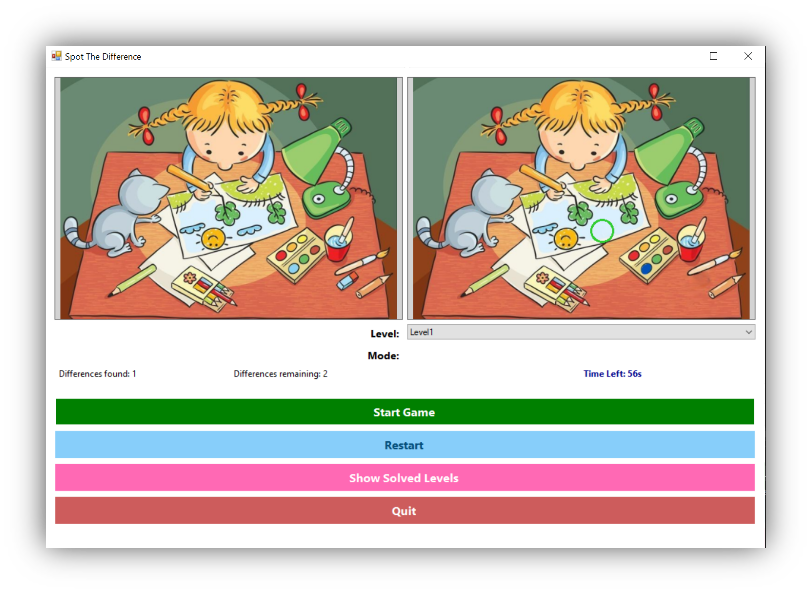

# 🎮 Spot The Difference Game

A desktop game built with **WinForms (C#)** and **Emgu.CV** that challenges players to spot differences between two similar images. It supports multiple play modes, levels, sound effects, and a solved levels gallery.

---

## ✨ Features

- 🔍 **Two Play Modes**:  
  - *Timer Mode*: Find all differences before the timer runs out.  
  - *Attempt Limit Mode*: Limited number of lives to find differences.

- 🖼️ **Level Selection**:  
  Automatically loads levels from the `images/` directory.

- 🎯 **Difference Detection**:  
  Uses color-based rectangle comparison via Emgu.CV.

- 🔊 **Sound Effects**:  
  Feedback sounds for correct and wrong clicks, winning, and losing.

- 💾 **Solved Levels**:  
  Stores solved levels and allows users to view or delete them.

---

## 🧠 How It Works

- The game compares two images side by side (`left.png` and `right.png`) from a selected level folder.
- Differences are identified using a custom Emgu.CV function.
- Users click on the right image to spot differences.
- Clicks are validated based on proximity to the actual difference centers.
- A correct click marks the spot visually and updates the score.

---

## 🚀 Getting Started

### ✅ Requirements

- Windows OS  
- [.NET Framework](https://dotnet.microsoft.com/en-us/download/dotnet-framework)  
- [Emgu.CV](https://www.emgu.com/wiki/index.php/Main_Page)

### 🔧 Setup

1. Clone or download the repository.
2. Build and run the project from **Visual Studio**.

## 🕹️ Controls

| UI Component         | Description                                  |
|----------------------|----------------------------------------------|
| `Start Game`         | Loads images and begins the game             |
| `Restart`            | Restarts the current level                   |
| `Show Solved Levels` | Opens a gallery of solved level screenshots  |
| `Quit`               | Exits the game (visible only during play)    |

---

## 📸 Solved Levels Feature

- Every time the player successfully completes a level, a screenshot is saved in `solved_levels/`.
- Right-click any image to **delete** it from the gallery.

---

## 🛠️ Tech Stack

- **Language**: C# (.NET Framework)  
- **UI**: WinForms  
- **Image Processing**: Emgu.CV  
- **Audio**: System.Media.SoundPlayer

## 🧪 Example Screenshot

Here is a sample screenshot of the game interface:

## Project Report

This project is part of my college coursework (multimedia).  
You can find the detailed project report (in Arabic) here:  
[Download the Project Report (PDF)](info/spotthedifferencegameReport.pdf)

---

## 📄 License

This project is licensed for educational and non-commercial use.  
Feel free to modify and improve it!
   

